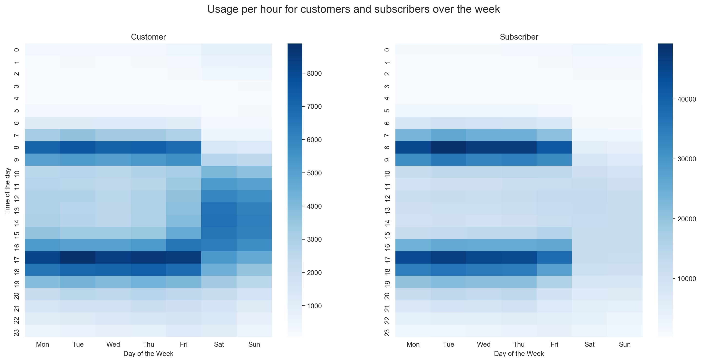
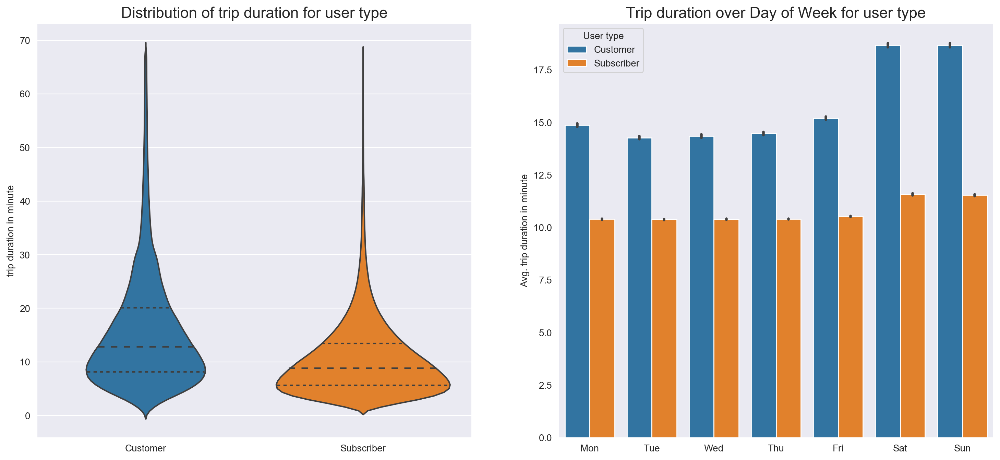

# Bay Wheels Data 2019 Data Exploration and Visualization
##### by Markus Müller

This is the final project from the Data Analyst Nanodegree from Udacity.
The goal of this project is to creat a presentation with explanatory visualizations.

## Introduction
<a href='https://en.wikipedia.org/wiki/Bay_Wheels'>Wiki:</a> Bay Wheels is a regional public bicycle sharing system in the San Francisco Bay Area, California operated by Motivate in a partnership with the Metropolitan Transportation Commission and the Bay Area Air Quality Management District. Bay Wheels is the first regional and large-scale bicycle sharing system deployed in California and on the West Coast of the United States. It was established as Bay Area Bike Share in August 2013.

## Data wrangling:
- Transformed various columns into their right format: start_time and end_time to datetime and user_type as well as start_time_day to categorical
- Dropped bike_share_for_all_trip and rental_access_method since they had to many missing values and weren’t part of my explanatory analysis
- Added some time related columns like an extra column for day of the Week and Month
- Calculated duration in minutes from duration_sec to enhance interpretability
- Removed outliers from the duration in minutes column to enable fair
comparison between user types, since outliers influence means.

## Main findings:
The bike rental system gets a lot more usage from subscribers than from customers, this is most likely due to the reason that the service is used by people who are commuting to work and therefore subscribe to the service to enhance ease of use. It becomes obvious, when looking at the different usage patterns across the week. Customers use the service every day, whereas subscribers use it most frequently on workdays at 8 a.m. and 5 p.m., which are the busiest hours in the day for both user types. In general people use the service more on workdays than on weekends. But this is due to the fact that subscribers are outnumbering customers. For Customers the usage is the same on weekends and workdays, but the time spend on a bike is higher on weekends than on workdays. This is also true for subscribers but not in the same ratio, which is higher for customers.
The average duration on the bike is for Customers 5 minutes longer than for Subscribers which have an average duration of 11 minutes. Regarding the usage duration, subscribers are driving the same amount every workday, whereas for customers the duration varies from workday to workday and increase on the weekend.

## Example Visualisations

## Resources:
- https://en.wikipedia.org/wiki/Bay_Wheels
- https://stackoverflow.com/questions/16074392/getting-vertical-gridlines-to-appear-in-line-plot-in-matplotlib
- https://stackoverflow.com/questions/58274401/importing-multiple-csv-files-into-pandas-and-merge-them-into-one-dataframe
- https://pandas.pydata.org/pandas-docs/stable/reference/api/pandas.DataFrame.info.html
